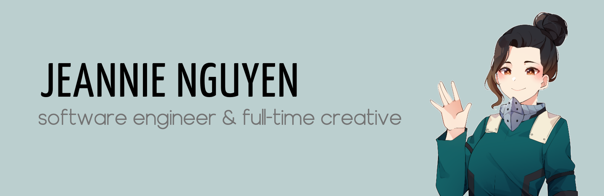

# Hi, I'm Jeannie 👋🏼

I'm a software engineer in LA who loves to create technology that elevates others and builds community. 🌎&nbsp; I bring stories to life through code and write about my journey as a developer.

## Find me around the web

- Sharing stories on [LinkedIn](https://www.linkedin.com/in/jeannie-t-nguyen/)
- Documenting my journey on [Dev.to](https://dev.to/jeannienguyen)

## A few projects

- [Change the Bias](https://changethebias.com/) #BlackLivesMatter [HTML, CSS, JS + Google Analytics + Netlify]
- [Tiny Versus Bot: Get Your Pokémon Team](http://tinyversusbot.herokuapp.com/) [Python + Heroku]
- [Twitter Bot Skeleton](https://github.com/jeannienguyen/mha_screencaps) [Python + AWS Lambda]
